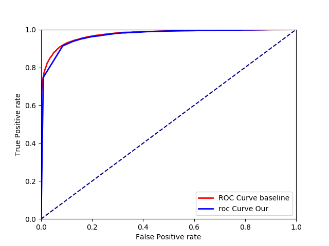

# ODIN_keras_version
Out-of-distribution을 검출하는 방법론 중 하나인 odin(pytorch)을 keras화 하였습니다.

# ODIN

out-of-distribution을 검출하는 Odin의 장점은 pretrained된 model을 그대로 사용할 수 있다는 점입니다.

기존의 pretrained model에 추가적으로 T scaling과 perturbation을 적용하여,

in-distribution과 out-of-distribution을 구분할 수 있습니다.

reference : https://github.com/facebookresearch/odin

# result

- 아래 그래프를 보면, ROC커브가 개선되었음을 알 수 있다.
  (Temperature=1000, Magnitude=0.0014)
  
- 

- 실험 상세 내용

  In-distribution dataset:                     CIFAR-10
  
  Out-of-distribution dataset:     Tiny-ImageNet (crop)
  
                            Baseline         Our Method
                            
  FPR at TPR 95%:              14.9%               2.1% 
  
  Detection error:              8.3%               3.8%
  
  AUROC:                       97.4%              98.6%
  
  AUPR In:                     97.8%              99.0%
  
  AUPR Out:                    97.1%              99.7%
  
